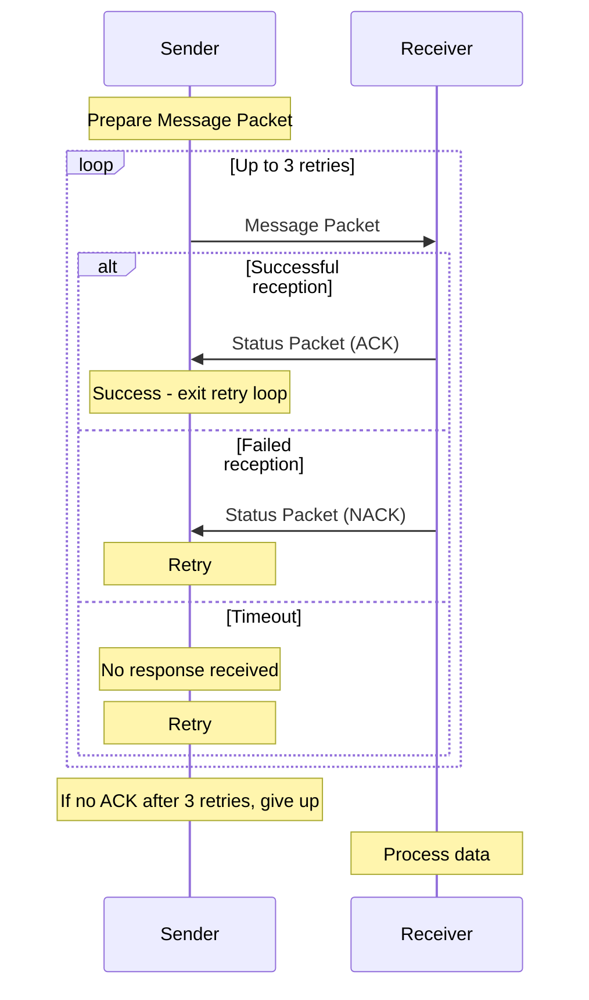

# Radio ARQ Protocol

- [Overview](#overview)
- [Packet Structure](#packet-structure)
- [Protocol Operation](#protocol-operation)
- [API Reference](#api-reference)
  - [radio\_arq\_send](#radio_arq_send)
  - [radio\_arq\_receive](#radio_arq_receive)
- [Implementation Details](#implementation-details)
- [Limitations](#limitations)
- [Example Usage](#example-usage)


## Overview

The Radio ARQ (Automatic Repeat Query) protocol provides reliable message delivery over an unreliable radio link. It implements a simple stop-and-wait ARQ mechanism where the sender transmits a packet and waits for an acknowledgment before proceeding.

## Packet Structure

The protocol uses two main packet types:

1. **Message Packet**

```
+------+------------------+
| Type | Data             |
| (1B) | (up to 20 bytes) |
+------+------------------+
```

- Type: Set to ARQ_PACKET_TYPE_MESSAGE (1) for message packets
- Data: Contains the actual payload data (up to 20 bytes)

2. **Status Packet**

```
+------+--------+-----------+
| Type | Status | Reserved  |
| (1B) | (1B)   | (2B)      |
+------+--------+-----------+
```

- Type: Set to ARQ_PACKET_TYPE_STATUS (2) for status packets
- Status:
  - 1 for ACK (acknowledgment)
  - 0 for NACK (negative acknowledgment)
- Reserved: Unused bytes reserved for future extensions

## Protocol Operation

**Message Transmission**

1. Sender constructs a message packet with the data to be transmitted
2. Sender transmits the packet via radio
3. Sender waits for a status packet in response
4. If an ACK is received, transmission is considered successful
5. If a NACK is received or no response arrives (timeout), the sender retries
6. After a maximum of 3 retries, the sender gives up

**Message Reception**

1. Receiver waits for an incoming packet
2. Upon receipt, the receiver checks if the packet was received correctly
3. If received correctly, the receiver sends an ACK status packet
4. If received with errors, the receiver sends a NACK status packet



## API Reference

### radio_arq_send

```c
void radio_arq_send(void *src, size_t src_len)
```

Sends data with automatic retry capability.

**Parameters:**

- `src`: Pointer to the data to be sent
- `src_len`: Length of the data in bytes (max 20 bytes)

**Behavior:**

Blocks until either the message is acknowledged or all retries are exhausted
Uses an internal busy flag to prevent concurrent operations
Returns without sending if another operation is already in progress

**Example:**

```c
uint32_t data = 0x12345678;
radio_arq_send(&data, sizeof(data));
```

### radio_arq_receive

```c
void radio_arq_receive(void *dest, size_t dest_len)
```

Receives data and automatically sends acknowledgment.

**Parameters:**

- `dest`: Pointer to buffer where received data will be stored
- `dest_len`: Size of the destination buffer in bytes

**Behavior:**

- Blocks until a packet is received or an error occurs
- Automatically sends ACK or NACK based on reception status
- Copies received payload data to the destination buffer
- Uses an internal busy flag to prevent concurrent operations
- Returns without receiving if another operation is already in progress

**Example:**

```c
uint32_t received_data;
radio_arq_receive(&received_data, sizeof(received_data));
```

## Implementation Details

- The protocol uses a 3-retry mechanism for reliability
- The implementation is not thread-safe - concurrent calls to send/receive are prevented with a busy flag
- Timeout for waiting for acknowledgment is set to 1500 microseconds
- The protocol has minimal overhead (1-4 bytes per packet depending on type)
- Debug information is available through probe signals for troubleshooting

## Limitations

- Maximum payload size is limited to 20 bytes
- No support for packet sequencing (vulnerability to duplicate packets)
- No fragmentation support for larger messages
- No addressing - intended for point-to-point communication
- Blocking implementation - caller must wait for completion

## Example Usage

1. Initialize the radio hardware:

2. Device A sends data and waits for acknowledgment:

```c
uint32_t switches = get_switch_state();
radio_arq_send(&switches, sizeof(switches));
```

3. Device B receives data and automatically acknowledges:

```c
uint32_t received;
radio_arq_receive(&received, sizeof(received));
update_leds(received);
```

The protocol ensures that the data is delivered reliably despite potential packet loss or corruption in the radio channel.
